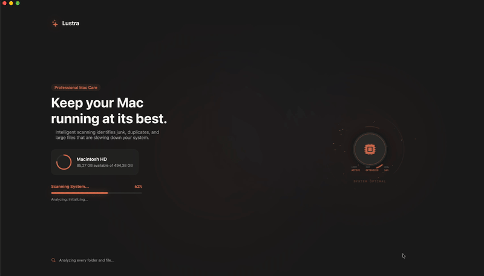
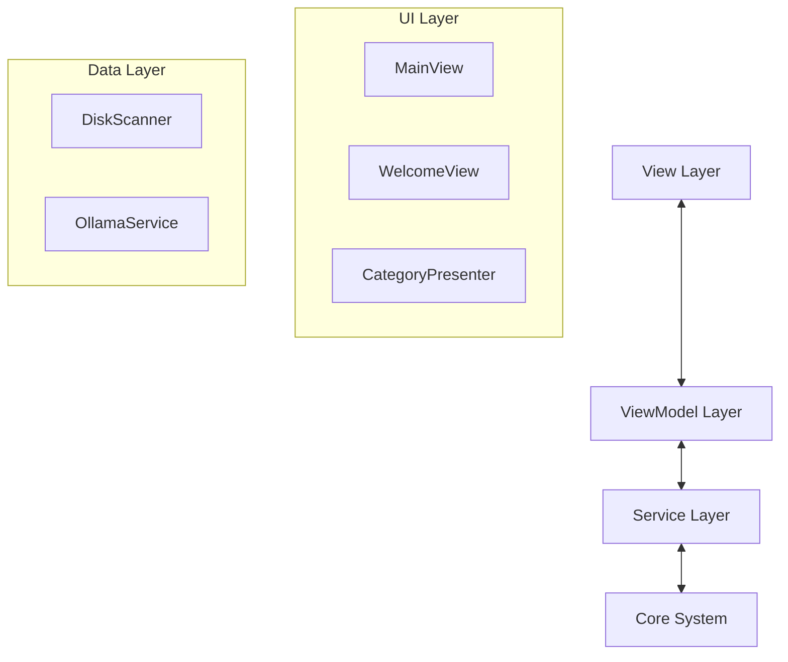

# Lustra
### The Pinnacle of macOS Elegance & Performance

 

**Lustra** isn't just a cleaning tool; it's a statement. Engineered with precision and designed with an obsession for aesthetics, it breathes new life into your Mac. Experience the perfect harmony of power, safety, and visual luxury.

 

*(This is a compressed GIF. For the full quality video, see `docs/assets/lustra_demo.mov`)*

---

## 📥 Installation

1.  Download the latest version from the **[Releases Page](https://github.com/senoldogann/Lustra-Macebook-Device-Cleaner/releases/latest)**.
2.  Open `Lustra_Installer.dmg`.
3.  Drag **Lustra** to your Applications folder.
4.  Launch the app and enjoy!

> **Note:** If you see a warning saying *"Lustra can't be opened..."*:
> 1.  Right-click (or Control-click) the app icon.
> 2.  Select **Open**.
> 3.  Click **Open** in the dialog box.
> *(This happens because the app is not signed with a paid Apple Developer certificate yet.)*

---

## 🚀 Key Features

### 🛡️ Smart Cleanup
AI-powered analysis identifies safe-to-delete files while strictly protecting system critical components.
- **Intelligent Analysis:** Scans your system without touching `System`, `Library/Kernels`, or protected app data.
- **Safety First:** Built-in safeguards preventing accidental deletion of vital macOS files.

### ⚡ Blazing Fast Scan
optimized unix `du` implementation for ultra-fast directory traversal.
- **Multi-threaded Scanning:** Utilizes full CPU power for rapid analysis.
- **Real-time Visualization:** Beautiful animated feedback during the scanning process.

### 🎨 Visual Disk Analysis
Premium visualization tools to understand your storage usage at a glance.
- **Sunburst Chart:** Interactive radial view of your file system.
- **Treemap Integration:** Rectangular density visualization for identifying large blocks of data.

---

## 🛠 Technology Stack

Engineered with the latest Apple technologies for maximum performance and native look-and-feel.

| Component | Technology | Description |
|-----------|------------|-------------|
| **UI Framework** | SwiftUI | Modern, declarative user interface |
| **Architecture** | MVVM | Clean separation of concerns |
| **Concurrency** | Swift Concurrency | Async/await & Actors for thread safety |
| **Analysis** | Local AI (Ollama) | *Optional* integration for intelligent file advice |
| **Build System** | Xcode 15+ | Native development environment |

---

## 🏗 Architecture

Lustra follows a strict **MVVM** pattern with a clean separation between Data and UI layers.

---

3. **Build & Run**
   Press `Cmd + R` to build and run the application.

---

## 🤝 Contributing

Contributions are welcome! Please feel free to submit a Pull Request.

---

    Designed by Senol Dogan & Built with ❤️ for macOS

