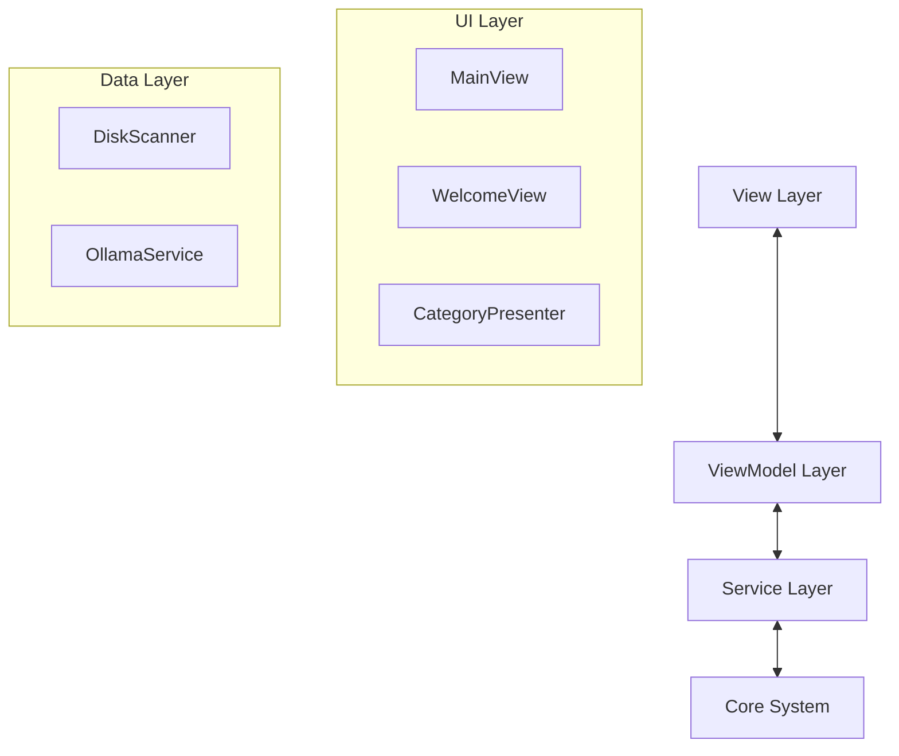

<div align="center">

# ✨ Lustra
### Intelligent Device Care for macOS

[](https://developer.apple.com/swift/)
[](https://www.apple.com/macos/)
[](LICENSE)
[]()

<br/>

**Lustra** is a state-of-the-art macOS cleaning utility engineered for speed, safety, and simplicity. Built with pure SwiftUI and powered by advanced algorithms, it helps you reclaim disk space without compromising system stability.

<br/>


https://github.com/senoldogann/Lustra-Macebook-Device-Cleaner/assets/lustra_demo.mov

*(Video: Open `docs/assets/lustra_demo.mov` to view the demo)*

</div>

---

## 🚀 Key Features

### 🛡️ Smart Cleanup
AI-powered analysis identifies safe-to-delete files while strictly protecting system critical components.
- **Intelligent Analysis:** Scans your system without touching `System`, `Library/Kernels`, or protected app data.
- **Safety First:** Built-in safeguards preventing accidental deletion of vital macOS files.

### ⚡ Blazing Fast Scan
optimized unix `du` implementation for ultra-fast directory traversal.
- **Multi-threaded Scanning:** Utilizes full CPU power for rapid analysis.
- **Real-time Visualization:** Beautiful animated feedback during the scanning process.

### 🎨 Visual Disk Analysis
Premium visualization tools to understand your storage usage at a glance.
- **Sunburst Chart:** Interactive radial view of your file system.
- **Treemap Integration:** Rectangular density visualization for identifying large blocks of data.

---

## 🛠 Technology Stack

Engineered with the latest Apple technologies for maximum performance and native look-and-feel.

| Component | Technology | Description |
|-----------|------------|-------------|
| **UI Framework** | SwiftUI | Modern, declarative user interface |
| **Architecture** | MVVM | Clean separation of concerns |
| **Concurrency** | Swift Concurrency | Async/await & Actors for thread safety |
| **Analysis** | Local AI (Ollama) | *Optional* integration for intelligent file advice |
| **Build System** | Xcode 15+ | Native development environment |

---

## 🏗 Architecture

Lustra follows a strict **MVVM** pattern with a clean separation between Data and UI layers.



---

## 📦 Installation

1. **Clone the repository**
   ```bash
   git clone https://github.com/senoldogann/Lustra-Macebook-Device-Cleaner.git
   ```

2. **Open in Xcode**
   Double click `MacCleaner.xcodeproj`

3. **Build & Run**
   Press `Cmd + R` to build and run the application.

---

## 🤝 Contributing

Contributions are welcome! Please feel free to submit a Pull Request.

---

<div align="center">
    <sub>Designed & Built with ❤️ for macOS</sub>
</div>
